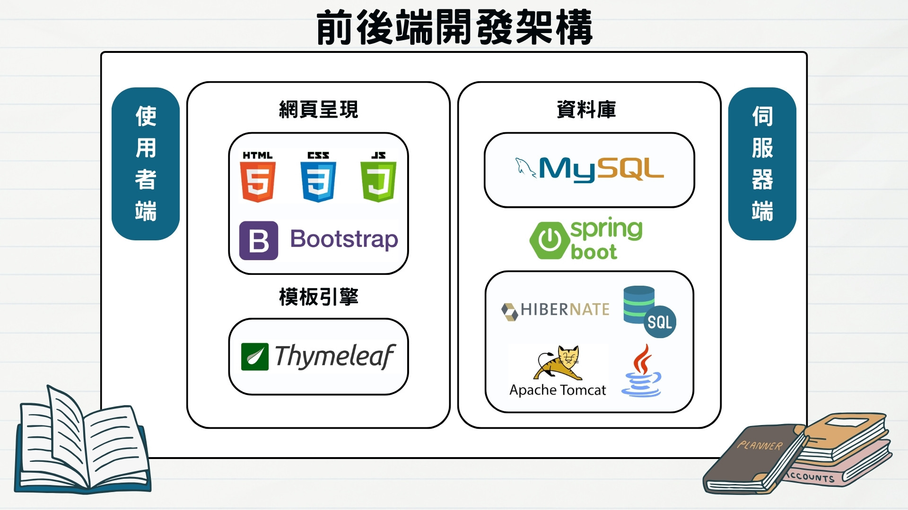
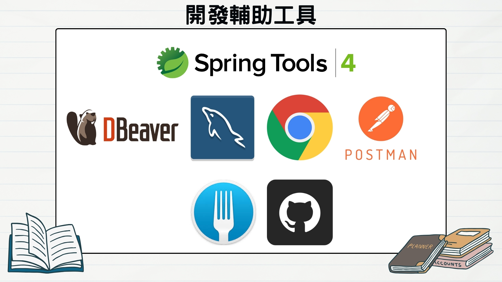

# Library Management System

## 簡介
這是一個用Java開發的圖書館管理系統，系統使用者分為未登入者、讀者、圖書館職員以及管理者。不同使用者權限將有不同之功能。系統包含基本書籍、讀者、出版社、借閱等管理功能，以及額外功能如活動管理、輪播展示、Email寄信通知等等。

## 前後端開發架構

### 關於Spring Boot
Spring Boot是一個建立在Spring框架之上的開源專案,旨在簡化Spring應用程式的初始搭建和開發過程。它的主要特點包括:
1. 自動配置 (Auto Configuration)：Spring Boot會自動根據你加入的jar包來配置應用程式,無需進行過多手動設定。
2. 內嵌的Tomcat、Jetty或Undertow容器：Spring Boot內嵌了常用的servlet容器,無需部署到外部容器中。
3. 啟動器 (Starter)：提供一系列方便的啟動器(Starter),只需在專案中加入對應啟動器,即可獲得所需的所有相關依賴。
4. 監控和管理：Spring Boot專案內建了actuator模組,可以用來監控應用程式的運行情況。
5. 外部化配置：允許我們將配置信息寫在不同的地方,例如本地文件、環境變量等。

### 關於Thymeleaf
Thymeleaf是一種用於Web和非Web環境的modern server-side Java template engine。它的主要特點包括:
1. 靜態原型：Thymeleaf可以生成靜態原型頁面,方便前端和後端並行開發。
2. 自然模板：Thymeleaf使用一種非常簡潔的語法,模板能夠直觀表達所需要的邏輯。
4. 響應式：Thymeleaf模板可以響應單個屬性的更改,而不需重新渲染整個頁面。
5. 國際化：Thymeleaf提供了對於國際化(i18n)資源的內建支持。
6. Java集成：Thymeleaf提供了對JaveScript和Java Bean的支持。
7. 模塊化：Thymeleaf支持通過佈局定義器(Layout Decorator)和佈局管理器(Layout Manager)實施模板繼承。
8. 安全性：Thymeleaf提供了防止常見Web漏洞(如XSS)的機制。

在Spring Boot中,Thymeleaf是Web模板引擎的常見選擇。它簡單易用,與Spring框架的集成自然無縫。許多開發者喜歡使用Thymeleaf來開發現代化的、響應式的Web應用界面。 

### 關於Hibernate
Hibernate是一個開源的對象關係映射(ORM)框架,它為Java語言提供了對象持久化的解決方案。使用Hibernate可以讓開發者採用面向對像的思維來操作關系型資料庫,而不用直接編寫大量的SQL語句。以下是Hibernate的一些主要特點:
1. 輕量級：Hibernate是一個輕量級的框架,需要很少的配置就可以運行。
2. 資料庫無關性：Hibernate支援多種關係型資料庫,如MySQL、Oracle、SQL Server等,開發者無需關心底層資料庫的差異。
3. 查詢語言：Hibernate提供了HQL(Hibernate查詢語言),類似SQL但面向對像,開發者也可使用原生SQL查詢。
4. 緩存機制：Hibernate內建了一級和二級緩存機制,提高了系統的性能。
5. 對象狀態管理：Hibernate會自動跟蹤對象的創建、修改和刪除狀態,并根據狀態生成適當的SQL語句。
6. 關係映射：Hibernate通過映射文件或註解的方式,將Java對象與資料庫表建立映射關係。

總之,Hibernate框架屏蔽了許多底層的數據持久化操作,大大簡化了JDBC的繁瑣編程。它是幾乎所有Java企業級應用都會使用的ORM框架之一。

## 開發輔助工具

### 關於Spring Tool 4
Spring Tool 4(STS)是一個基於Eclipse平台構建的開發工具,專門用於簡化開發Spring應用程序的過程。以下是STS的一些主要特點:
1. 項目創建向導：STS內置了Spring項目創建向導,可以輕鬆創建各種類型的Spring項目,包括普通Spring MVC、Spring Boot等。
2. Spring支持：STS對Spring框架提供了全面支持,包括自動完成、快捷鍵、工具條等,幫助開發者提高編碼效率。
3. Spring Boot支持：STS深度整合了Spring Boot,可以輕鬆創建、運行、調試和部署Spring Boot應用。
4. Bean自動配置：STS能自動識別和配置Spring Bean,幫助管理Bean的依賴關係。
5. 調試支持：STS內置了方便的調試功能,支持在服務器中調試Spring應用。
6. 編輯器功能：STS編輯器針對Spring XML和Java配置提供了智能提示、高亮、格式化等功能。
7. Cloud支持：STS還集成了對Spring Cloud的支持,簡化了開發基於云的應用。

STS將Eclipse和Spring緊密結合,為Spring開發者提供了一個功能強大且易用的工具,大大降低了Spring開發的門檻和複雜性。無論是個人開發還是企業級項目,都可以考慮使用STS。

### 關於Postman
Postman是一款功能強大的API開發工具,它可以幫助開發人員設計、模擬、測試和記錄API請求。以下是Postman的一些主要特性:
1. 請求構建器：Postman提供了一個使用者介面,允許開發人員構建各種HTTP請求(GET、POST、PUT、DELETE等),設置請求頭、請求體和URL參數。
2. 環境變量管理：支持創建和管理環境變量,以方便切換不同的環境(開發、測試、生產等)。
3. API文檔生成：Postman能自動生成詳細的API文檔,包括請求詳情、響應示例以及可視化的API流程圖等。
4. 測試腳本編寫：可以使用JavaScript編寫測試腳本,驗證API響應數據的正確性。
5. API監控：Postman提供了監控API性能的功能,可以監控API的響應時間、失敗率等指標。
6. 協作功能：支持團隊協作,可以共享API集合、環境變量和測試腳本。
7. Newman：Newman是Postman推出的命令行運行器,可以從命令行運行Postman集合。
8. 集成支持：Postman支援與眾多工具集成,如Git、Jenkins、Travis CI等。

無論是API開發、測試還是文檔編寫,Postman都提供了完整的解決方案,幫助開發人員高效地管理和操作API,是一個非常實用的工具。

### 關於Fork
Fork是一個分布式版本控制系統(DVCS),它以Git為基礎,提供了圖形用戶界面和一些其他功能增強。以下是Fork的一些主要特點:
1. 基於Git：Fork使用Git作為核心版本控制系統,因此它支持Git的所有基本功能,如分支、合併、提交等。
2. 圖形用戶界面：與命令行不同,Fork提供了直觀的圖形用戶界面,使用起來更加簡單直觀。它展示了代碼變更的視覺效果。
3. 文件合併工具：Fork內置了強大的文件合併工具,可以有效解決合併衝突。它支持側邊欄的三向合併視圖。
4. Git服務器：Fork包含了一個內置的Git伺服器,可以輕鬆地托管和管理Git存儲庫。
5. 拉取請求：Fork支持創建拉取請求,從而更好地支持團隊協作開發。
6. 分支視圖：Fork使用分支視圖清晰展示存儲庫中的所有分支及其提交歷史。
7. Stash支持：Fork對Git的stash功能提供了圖形化支持。

